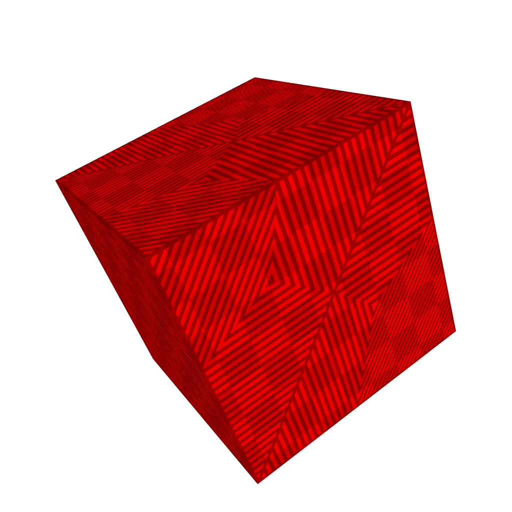

Shadybug
========

Shadybug is a simple reference software renderer to be used for debugging shaders.

It's designed to make it easy to port shaders to Rust, and run them for one triangle or four pixels.

Examples
--------

Try this:

    cargo run --example cube  --features image

which should create an image named `cube.png`:

